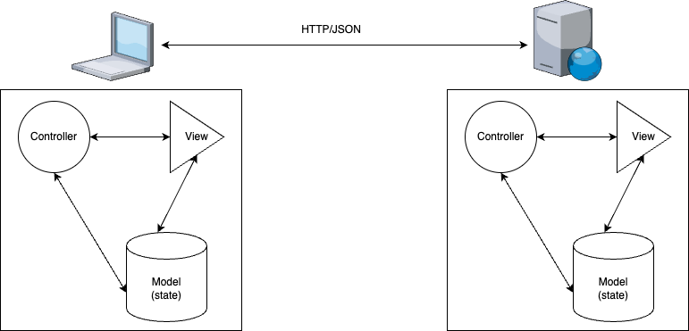

---


# LiveState: LiveView Re-Imagined
Chris Nelson
@superchris


---

<!-- footer:  -->
# Who am I?
- Long-time (old) Elixirist
- Co-Founder of Launch Scout
- Creator LiveState (and friends)

---

# Let's start with the obvious:

---

# Why the heck would you re-imagine LiveView?

---

# I come to praise LiveView, not to bury it
### LiveView is absolutely excellent, if you are or are willing to become an Elixirist

---

# But what about everybody else?
- We have a solution to the most difficult problem in web application development
- But we're hiding it under a rock

---

# And what about us?
- We can stay happily in Elixir and never touch the nasty javascript
- But we also miss out on some really excellent innovations going on

---

# And there are things worth paying attention to...
- Custom Elements
- Import maps
- Signals
- Or even the humble `<dialog>`

---

# What makes web application development so hard?
## This?


---

## Or this?


---

# Why do we really love LiveView?
- It gives a sensible way to manage state
- We get to build one application instead of two

---

# LiveState
### An attempt to have the things we love about LiveView without Elixir rendering our view
- An elixir library (live_state)
- A javascript library (phx-live-state)
- Both are thin abstractions over Phoenix Channels

---

# How it works

- `phx-live-state` sends Custom Events over channel as `lvs:event_name`
- Receives `state:change` events to update local state
  - or `state:patch` containing JSON patches
- state updates trigger re-renders
  - **This part I get for free**

---

# Example time: An airport map element
- Custom element we can drop on any page
- Displays pins for aiport data on a map
- Fetches when the user pans/zooms

---
## Airport map element
```ts
@customElement('airport-map')
@liveState({
  topic: 'airport_map',
  events: {
    send: ['tilesloaded', 'bounds_changed']
  }
})
export class AirportMapElement extends LitElement {
  
  @property({attribute: 'api-key'})
  apiKey: string = '';

  @liveStateConfig('url')
  @property()
  url: string = '';

  @state()
  @liveStateProperty()
  airports: Array<Airport> = [];

  render() {
    return html`
      <div class="map">
        <lit-google-map api-key=${this.apiKey} version="3.46">
          ${this.airports?.map(({name, identifier, latitude, longitude}) => html`
            <lit-google-map-marker slot="markers" latitude=${latitude} longitude=${longitude}>
              <p>${name} (${identifier})</p>
            </lit-google-map-marker>        
          `)}
        </lit-google-map>
      </div>    
    `;
  }
}

```

---
# Airports channel
```elixir
defmodule LiveElementsLabsWeb.AirportMapChannel do
  use LiveState.Channel, web_module: LiveElementsLabsWeb

  alias LiveElementsLabs.Airports

  @impl true
  def init(_params, _session, _socket) do
    {:ok, %{api_key: System.get_env("API_KEY")} }
  end

  @impl true
  def handle_event("bounds_changed", event_payload, state), do: load_airports(event_payload, state)

  @impl true
  def handle_event("tilesloaded", event_payload, state), do: load_airports(event_payload, state)

  defp load_airports(%{"north" => north, "east" => east, "west" => west, "south" => south}, state) do
    airports =
      Airports.list_airports_in_bounds(%{north: north, east: east, west: west, south: south})

    {:noreply, state |> Map.put(:airports, airports)}
  end
end
```
---

# Why should we stick with web standards?
## We can reinvent our own better stuff!

---

# Sure, maybe but...
- We are taking on significant risk
- We have a *lot* more to do
- We might miss out on new great stuff

---

# So LiveState got me thinking...
- Could I make developing my front end even simpler?
- What if you could just start from just an HTML file?

---

# Introducing LiveTemplates
- `<live-template>` connects a client side template to a LiveState channel
- sends events
- re-renders on state change

---

# Let's make a CRM!

---

# Excerpts from PeopleChannel
```elixir
  @impl true
  def init(_channel, _params, _socket) do
    {:ok, %{people: People.list_people(), errors: %{}, editing: false, person: %People.Person{}}}
  end

  def handle_event("save-person", person, state) do
    case People.create_person(person) do
      {:ok, saved_person} ->
        {:noreply,
         %{
           people: People.list_people(),
           person: saved_person,
           editing: false
         }}

      {:error, changeset} ->
        {:noreply, state |> Map.put(:errors, format_errors(changeset)) |> Map.put(:person, person)}
    end
  end
```

---

# Let's start!

---


- slides: https://github.com/launchscout/elixirconf2023-beyond-liveview
- live_elements: https://github.com/launchscout/live_elements
- live_state elixir library: https://github.com/launchscout/live_state
- phx-live-state client npm: https://github.com/launchscout/live-state

---
